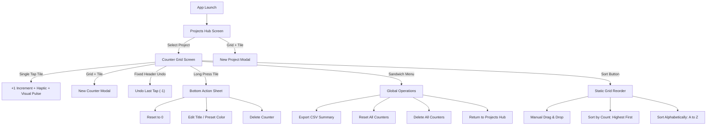

# Refined Design Specification: Counter App (PWA)

## 1. Executive Summary & Core Concept

The **Counter App** is a mobile-first Progressive Web App (PWA) designed for Google Pixel 10 and Android devices. It enables fast, friction-free categorization and counting of fast-moving real-world items (e.g., vehicle makes in a parking lot, house types on a street, field research tallies).

### Key Architectural & UX Highlights:
- **High-Density Grid Layout**: 2-column or 3-column scrollable grid to maximize screen real estate and eliminate scroll friction when handling 10–15+ categories.
- **Instant Full-Surface Tapping**: Tapping anywhere on a counter button instantly increments the value (+1) accompanied by haptic feedback and a visual pulse animation.
- **Fixed Top-Bar "Undo" Action**: Instant single-tap fixed button to undo the previous increment without interrupting counting flow.
- **Inline "Add New" Grid Tile**: Dedicated dashed-border creation card placed directly at the end of the grid layout for natural inline expansion.
- **Static Grid Sorting**: Grid re-ordering (By Count, A-Z) strictly occurs upon explicit user button tap to prevent layout shift under active fingers.
- **Custom Tile Accent Colors**: Lightweight color palette options (6-8 theme colors) to visually distinguish categories at a glance.
- **Clean Contextual Secondary Actions**: Rare actions (single counter reset, title edit, color pick, deletion) are tucked into a long-press Action Sheet.
- **Multi-Project Organization**: Support for separate counter sets ("Projects" or "Folders") with a main Project Hub and detail Counter Grids.
- **Summary CSV Export & Native Android Sharing**: Rapid one-tap export formatted as a clean summary report with direct sharing via `navigator.share`.

---

## 2. Information Architecture & User Flow



---

## 3. Screen Specifications & Layout Design

### Screen A: Projects Hub Screen (Home)
- **Header**: App Logo/Title ("Counter Collections").
- **Main Body**: Grid of Project Cards displaying:
  - Active Project Cards (Title, category count, total items, created/updated timestamps).
  - **Inline Creation Tile**: Positioned at the end of the project grid with a muted background, dashed border, and central `+ New Project` text.
- **Card Tap**: Navigates to the Counter Grid screen for that specific project.
- **Card Long-Press / Options**: Edit project title, duplicate project schema, delete project.

### Screen B: Counter Grid Screen (Active Workspace)
- **Top Bar / Header**:
  - `← Back` button (returns to Projects Hub).
  - Active Project Title.
  - **Fixed "Undo" Button**: `↩ Undo` (Reverts last tap across any counter tile).
  - `Sort` Selector toggle (Manual, By Count, A-Z).
  - Sandwich Menu `⋮` (Global Actions).
- **Main Grid**:
  - Responsive 2-column or 3-column flexible grid view (`grid-template-columns: repeat(auto-fill, minmax(110px, 1fr))`).
  - Active Tile design:
    - High-contrast card with customizable visual accent border / top color strip.
    - Large category title at top.
    - Prominent bold counter number in center.
    - Full tile area acts as a single hit target.
  - **Inline Creation Tile**:
    - Positioned as the final tile in the grid.
    - Styled with a subtle muted theme, dashed border, and centered `+ Add Category` label.
    - Single tap opens the New Counter creation modal immediately.
- **Global Sandwich Menu Options**:
  - **Export CSV Summary**: Download/share CSV report of active project.
  - **Reset All Counters**: Prompts for confirmation before setting all counts to 0.
  - **Delete All Counters**: Secondary destructive action with clear warning.

---

## 4. Interaction Patterns & Touch Feedback

| Gesture / Trigger | Target | Result / Action | Feedback |
| :--- | :--- | :--- | :--- |
| **Single Tap** | Full Tile Surface | Increments count by **+1** & logs event | Short haptic vibration (`navigator.vibrate(25)`) + visual shrink-pulse animation |
| **Fixed Undo Button** | Header Bar | Undoes the most recent tap event | Haptic tick + counter count decremented by 1 |
| **Long Press (500ms)** | Counter Tile | Opens **Counter Action Sheet** bottom drawer | Distinct haptic double-pulse |
| **Action Sheet Options** | Drawer Items | • **Reset to 0**<br>• **Edit Category Name & Color Accent**<br>• **Delete Tile** | Immediate modal update & saved to storage |
| **Header Sort Switch** | Sort Icon | Reorders grid by Count, Title (A-Z), or Manual Drag (Static on request) | Smooth CSS transition/re-layout animation |
| **Drag & Drop** | Move Handle / Tile | Manually repositions counter tile order | Visual lift & drop placement |

---

## 5. Data Model & Storage Schema

Data persists client-side using browser `localStorage` (key `counter_app_state_v1`) with fallback preparation for `IndexedDB`.

```typescript
// State Root Structure
interface AppState {
  activeProjectId: string | null;
  projects: Record<string, Project>;
}

// Event Log Entry (for multi-level Undo stack and activity history)
interface CounterEvent {
  id: string;
  counterId: string;
  timestamp: number;
  delta: number; // +1 for tap, -1 for undo
}

// Project Schema
interface Project {
  id: string;
  title: string;
  createdAt: number; // UTC Timestamp
  updatedAt: number;
  counters: Counter[];
  events: CounterEvent[]; // Append-only tap history for Undo stack
}

// Counter Schema
interface Counter {
  id: string;
  projectId: string;
  title: string;
  count: number;
  orderIndex: number;
  colorHex?: string; // Optional accent color (e.g. #3B82F6, #EF4444, #10B981)
  createdAt: number;
  updatedAt: number;
}
```

---

## 6. CSV Data Export Format

Export generates a clean, simple `.csv` file formatted for direct import into Excel, Google Sheets, or python pandas.

### Clean Summary CSV Output Example:
```csv
Project Title,Parking Lot Cars Survey
Export Date,2026-08-08 17:30:00
Total Items Counted,87

Category Title,Total Count
Toyota,34
Honda,21
Ford,18
BMW,14
```

### Native Android Sharing (`navigator.share`):
If supported on Google Pixel 10 Chrome (`navigator.canShare`), the file blob is passed directly to the native Share Intent allowing 1-tap save to Google Drive, Gmail, or Local Storage. Fallbacks trigger direct file download.

---

## 7. Next Steps & Development Roadmap

1. **Phase 1: PWA Shell & Design System**:
   - Establish CSS design tokens, mobile dark/light mode palette with accent colors, responsive 2/3-column grid layout, and vibration/animation utilities.
2. **Phase 2: Core Counter Engine & Projects State**:
   - Build state store with event history stack for Undo.
   - Implement Project Hub navigation and Counter Grid UI.
3. **Phase 3: High-Speed Touch Controls & Fixed Undo**:
   - Add single-tap full-surface increment with haptic response.
   - Add fixed header `Undo` button.
   - Implement long-press Action Sheet (Reset, Edit Title & Accent Color, Delete).
   - Implement static grid sorting (Count, A-Z, Manual).
4. **Phase 4: CSV Generator & Sharing Integration**:
   - Implement clean 2-column CSV summary formatter and Web Share API integration.
5. **Phase 5: PWA Caching, Optional Audio Clicks & Deployment**:
   - Configure Web App Manifest, Service Worker for offline capabilities.
   - (Optional Future Addition): Web Audio API click feedback toggle.
   - Deploy via GitHub Pages.
